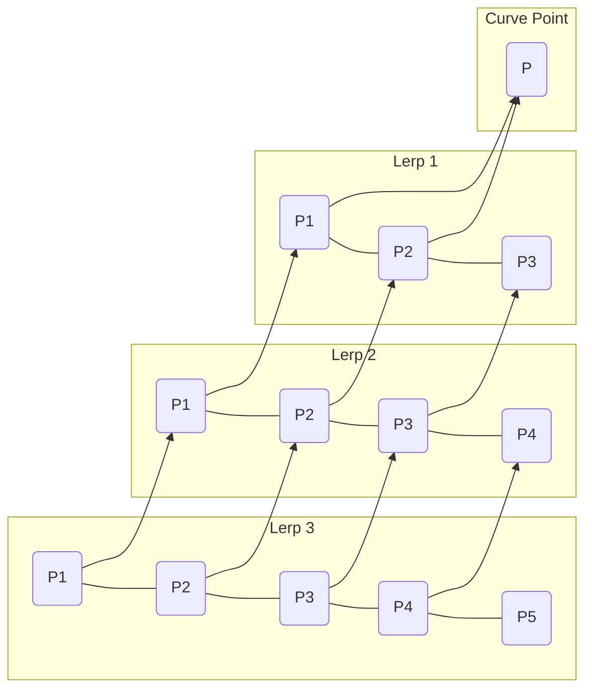

import { Callout, Steps, Step } from "nextra-theme-docs";

# Higher-degree Bézier Curves

While [quadratic](/bezier-curves/quadratic-cubic-bezier) and [cubic](/bezier-curves/quadratic-cubic-bezier) Bézier curves are the most commonly used, it is possible to create Bézier curves of higher degrees by adding more control points. The process of creating these curves follows the same principle of recursive linear interpolation, also known as **De Casteljau's algorithm**.

<Steps>

### Step 1: Define control points

To create a higher-degree Bézier curve, start by defining the desired number of control points. For an $n$-degree Bézier curve, you will need $n+1$ control points.

### Step 2: Apply De Casteljau's algorithm

Recursively apply linear interpolation between the control points until a single point remains. This point will lie on the curve for the given $t$ value.

</Steps>

The diagram above illustrates the process of creating a higher-degree Bézier curve (in this case, a quartic Bézier curve) using De Casteljau's algorithm.

<Callout type="warning">
  Higher-degree Bézier curves offer more flexibility in shaping the curve but come with some drawbacks:
  
  - They lack local control, as moving any single control point affects the entire curve.
  - Evaluating the curve becomes computationally expensive as the degree increases.
</Callout>

Due to these limitations, higher-degree Bézier curves are rarely used in practice. Instead, designers and developers often opt for [Bézier splines](/bezier-splines), which combine multiple lower-degree Bézier curves to create complex, smooth shapes while maintaining local control and computational efficiency.