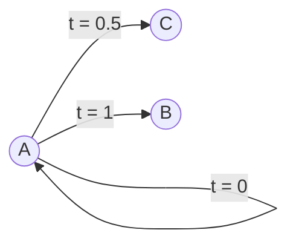

import { Callout, Steps, Step } from "nextra-theme-docs";

# Linear Interpolation (Lerp)

Linear interpolation, or lerp for short, is the most basic way to blend between two values. It's a fundamental concept in computer graphics and animation, and it plays a crucial role in the construction of Bézier curves.

## What is Lerp?

Lerp is a method of finding a point between two known points. It takes a parameter `t`, which represents the fraction of the distance between the two points. When `t = 0`, lerp returns the first point, and when `t = 1`, it returns the second point. For any value of `t` between 0 and 1, lerp returns a point that is proportionally between the two points.

<Callout>
Lerp is like a journey from one point to another, where `t` is how far along the journey you are.
</Callout>

Mathematically, lerp can be defined as:

$lerp(a, b, t) = a + t(b - a)$

where $a$ and $b$ are the two points, and $t$ is the parameter that controls the blending.

## Lerp in Action

Let's look at an example of how lerp works. Suppose we have two points, $A = (1, 1)$ and $B = (5, 5)$. We can use lerp to find points between $A$ and $B$.

<Steps>

### Step 1: Set t = 0

When $t = 0$, lerp returns the first point:

$lerp(A, B, 0) = A + 0(B - A) = A = (1, 1)$

### Step 2: Set t = 1

When $t = 1$, lerp returns the second point:

$lerp(A, B, 1) = A + 1(B - A) = B = (5, 5)$

### Step 3: Set t = 0.5

When $t = 0.5$, lerp returns the midpoint between $A$ and $B$:

$lerp(A, B, 0.5) = A + 0.5(B - A) = (3, 3)$

</Steps>

## Lerp in [Bézier Curves](/bezier-curves)

Lerp is the foundation of Bézier curves. In [quadratic and cubic Bézier curves](/bezier-curves/quadratic-cubic-bezier), lerp is used repeatedly to blend between control points, creating smooth curves. This process is known as [De Casteljau's algorithm](/bezier-curves/de-casteljau-algorithm).

By understanding lerp, you'll have a solid foundation for exploring the fascinating world of Bézier curves and their applications in computer graphics, animation, and design.