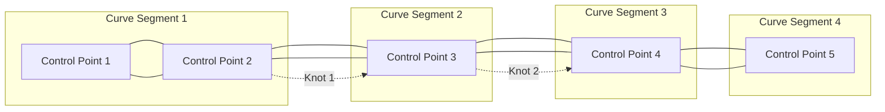

import { Callout, Steps, Step } from "nextra-theme-docs";

# Spline Anatomy

In this section, we'll dive into the key components that make up a Bézier spline. Understanding these elements will help you grasp how splines work and how they can be manipulated to create smooth, complex curves.

## Control Points

Control points are the fundamental building blocks of a Bézier spline. They define the shape of the curve and provide handles for manipulating its shape. In a Bézier spline, control points are connected by curve segments.

<Callout emoji="💡">
Control points in a Bézier spline do not necessarily lie on the curve itself, except for the start and end points.
</Callout>

## Curve Segments

Curve segments are the individual Bézier curves that make up a spline. Each curve segment is defined by four control points: the start point, two intermediate control points (also known as handles), and the end point.

The number of curve segments in a Bézier spline is determined by the number of control points:

- For $n$ control points, there are $n-1$ curve segments.

## Knots and Joins

Knots, also known as joins, are the points where two curve segments meet. In a Bézier spline, knots are defined by the shared end point of one curve segment and the start point of the next.

<Steps>
### Step 1

Identify the control points in your Bézier spline.

### Step 2

Determine the number of curve segments based on the number of control points.

### Step 3

Locate the knots where curve segments meet.
</Steps>

By understanding the anatomy of a Bézier spline, you'll be better equipped to create, manipulate, and analyze complex curves in your projects. In the next section, we'll explore how Bézier splines provide [local control and flexibility](/bezier-splines/local-control-flexibility) in shaping curves.