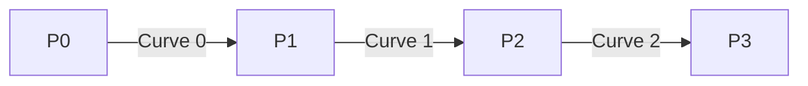

import { Callout, Steps, Step } from "nextra-theme-docs";

# Spline Parameterization

To traverse a Bézier spline, we need to extend the traditional parameter range of a single Bézier curve (0 to 1) to cover multiple curve segments. This is where *spline parameterization* comes into play.

## Introducing the u-value

In spline parameterization, we define a new parameter called the **u-value**, which represents the input parameter for the entire spline. The u-value spans across all curve segments, allowing us to smoothly traverse the entire spline.

<Callout type="info">
The u-value is an extension of the traditional t-value used in single Bézier curves. While t spans from 0 to 1, u spans across the entire spline.
</Callout>

## Mapping u-values to Curve Segments

To map a u-value to a specific curve segment, we follow these steps:

<Steps>
### Step 1: Determine the Curve Index

The integer part of the u-value represents the index of the curve segment. For example, a u-value of 2.7 corresponds to the third curve segment (index 2).

### Step 2: Calculate the Local t-value

The fractional part of the u-value represents the local t-value within the specific curve segment. In the previous example, a u-value of 2.7 would have a local t-value of 0.7 within the third curve segment.
</Steps>

By combining the curve index and the local t-value, we can precisely locate and evaluate any point along the Bézier spline.

## Example

Let's consider a Bézier spline with four control points:

To find the point on the spline corresponding to a u-value of 1.5:

1. The integer part (1) indicates that the point lies on the second curve segment (Curve 1).
2. The fractional part (0.5) represents the local t-value within Curve 1.

We can then evaluate the point using the Bézier curve equation for Curve 1 with a t-value of 0.5.

By understanding spline parameterization, you can easily map input values to specific points along a Bézier spline, enabling smooth traversal and evaluation of the entire spline.

<Callout type="success">
Spline parameterization is a crucial concept in working with Bézier splines. It allows you to seamlessly navigate and evaluate points across multiple curve segments, opening up a wide range of possibilities for path creation and animation.
</Callout>

For more information on the anatomy of a Bézier spline, check out the [Spline Anatomy](/bezier-splines/spline-anatomy) section.