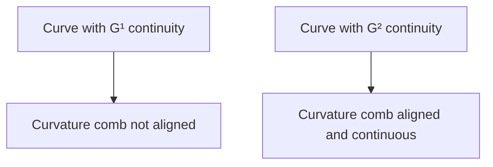

import { Callout, Steps, Step } from "nextra-theme-docs";

# Geometric Continuity

While [parametric continuity](/continuity/parametric-continuity) focuses on the continuity of the derivatives of a curve with respect to its parameter, geometric continuity is concerned with the visual smoothness of a curve, regardless of its parameterization. Geometric continuity is particularly important in applications such as industrial design and the creation of reflective surfaces, where the appearance of smoothness is crucial.

## G¹ Continuity (Tangent Continuity)

A curve is said to have G¹ continuity, or tangent continuity, if the tangent vectors at the join between two curve segments are aligned. This means that the curve has a continuous tangent direction, even if there is a discontinuity in the magnitude of the tangent vector (i.e., a sudden change in speed).

<Callout type="info">
G¹ continuity implies [C⁰ continuity](/continuity/parametric-continuity#c0-positional-continuity), but not necessarily [C¹ continuity](/continuity/parametric-continuity#c1-velocity-continuity).
</Callout>

To achieve G¹ continuity in a Bézier spline, the tangent points at the join must be aligned:

$P₄ = P₃ + β₁(P₃ - P₂)$

where $β₁$ is a positive scalar value.

## G² Continuity (Curvature Continuity)

G² continuity, or curvature continuity, is a higher level of geometric continuity that ensures the curvature of the curve is continuous across the join. This is crucial for creating smooth, reflective surfaces in industrial design, such as car bodies or phone casings.

To analyze curvature continuity, we can use the concept of the **osculating circle**, which is the circle that best approximates the curve at a given point. The radius of this circle is the reciprocal of the curvature at that point.

<Steps>
### Step 1

Calculate the curvature at a point using the following formula:

$κ = \frac{|v × a|}{|v|³}$

where $v$ is the velocity vector, $a$ is the acceleration vector, and $×$ denotes the cross product.

### Step 2

Check if the curvature is continuous across the joins of the curve. If the curvature is continuous, the curve has G² continuity.
</Steps>

To achieve G² continuity in a Bézier spline, the following condition must be met:

$P₅ = P₃ + \frac{1}{4}(P₃ - P₂) + β₂(P₁ - P₃)$

where $β₂$ is a scalar value.

<Callout type="warning">
Achieving higher levels of geometric continuity, such as G² or G³, often comes at the cost of [reduced local control](/continuity/continuity-local-control) over the curve shape.
</Callout>

## Curvature Combs

A useful tool for visualizing curvature continuity is the **curvature comb**. A curvature comb is a series of lines drawn perpendicular to the curve, with their lengths proportional to the curvature at each point.

By observing the alignment and continuity of the curvature comb, we can quickly assess the geometric continuity of a curve.

## Conclusion

Understanding geometric continuity is essential for creating visually smooth curves and surfaces in various applications. By ensuring tangent (G¹) and curvature (G²) continuity, designers and engineers can create aesthetically pleasing and functional shapes, particularly in industrial design and computer graphics.