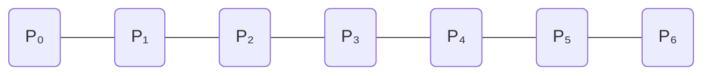

import { Callout, Steps, Step } from "nextra-theme-docs";

# Parametric Continuity

Parametric continuity is a measure of how smoothly a curve or spline transitions from one segment to another. It is determined by the continuity of the curve's derivatives at the joins between segments. The higher the degree of parametric continuity, the smoother the curve appears.

## Degrees of Parametric Continuity

There are several degrees of parametric continuity, denoted as C⁰, C¹, C², C³, and so on. Each degree represents the continuity of a specific derivative of the curve at the joins.

<Steps>

### C⁰ Continuity (Positional Continuity)

C⁰ continuity means that the curve segments are connected at the joins, ensuring a continuous path. However, there may be sharp corners or kinks at the joins.

### C¹ Continuity (Velocity Continuity)

C¹ continuity requires both C⁰ continuity and continuous first derivatives (velocity) at the joins. This ensures that the curve segments are tangent to each other at the joins, resulting in a smoother transition.

### C² Continuity (Acceleration Continuity)

C² continuity requires C⁰ and C¹ continuity, as well as continuous second derivatives (acceleration) at the joins. This results in an even smoother transition between curve segments, with no abrupt changes in curvature.

### C³ Continuity (Jolt Continuity)

C³ continuity requires C⁰, C¹, and C² continuity, as well as continuous third derivatives (jolt) at the joins. This level of continuity is rarely used in practice, as the visual difference between C² and C³ continuity is often negligible.

</Steps>

## Implications of Parametric Continuity

The degree of parametric continuity has a significant impact on the appearance and behavior of curves and splines. Here are some key implications:

- **Smoothness**: Higher degrees of parametric continuity result in smoother curves, with less noticeable transitions between segments.
- **Fairness**: Curves with higher parametric continuity appear more aesthetically pleasing and fair, which is important in design applications.
- **Animation**: When animating objects along a path, higher parametric continuity ensures smooth motion without sudden changes in velocity or acceleration.
- **Local Control**: Achieving higher levels of parametric continuity often requires sacrificing some local control over the curve's shape, as the continuity constraints can propagate changes across multiple segments.

<Callout emoji="⚠️">
It's important to note that parametric continuity is not the same as [geometric continuity](/continuity/geometric-continuity), which focuses on the continuity of the curve's shape rather than its parameterization.
</Callout>

## Example: Cubic Bézier Spline Continuity

Let's consider a cubic Bézier spline with two curve segments, A and B, joined at point P₃. The control points for each segment are:

- Curve A: P₀, P₁, P₂, P₃
- Curve B: P₃, P₄, P₅, P₆

To achieve C¹ continuity, we need to ensure that the velocity at the end of curve A matches the velocity at the start of curve B:

$\frac{dA}{dt}(1) = \frac{dB}{dt}(0)$

This can be achieved by aligning the control points P₂, P₃, and P₄ in a straight line, with P₄ being the reflection of P₂ about P₃.

To achieve C² continuity, we additionally need to ensure that the acceleration at the end of curve A matches the acceleration at the start of curve B:

$\frac{d^2A}{dt^2}(1) = \frac{d^2B}{dt^2}(0)$

This requires a more complex relationship between the control points, which can be derived algebraically.

By understanding and applying the principles of parametric continuity, you can create smooth, visually appealing curves and splines that behave predictably in various applications, such as computer graphics, animation, and [CAD](/other-spline-types/b-spline).