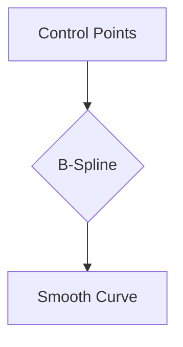

import { Callout, Steps, Step } from "nextra-theme-docs";

# B-Spline

B-splines, short for basis splines, are a type of spline that guarantees C² continuity, making them popular in industrial design applications where smooth, reflective surfaces are crucial. Unlike Bézier splines, B-splines sacrifice the interpolating property in favor of higher-order continuity.

## Characteristics of B-Splines

- **C² Continuity**: B-splines ensure that the position, velocity, and acceleration of the curve are continuous at the joins between curve segments. This results in a smoother appearance and is particularly important for designing reflective surfaces.

- **Non-Interpolating**: B-splines do not necessarily pass through their control points. Instead, the control points act as a guide for the overall shape of the curve.

- **Local Control**: Despite the higher-order continuity, B-splines maintain local control over the shape of the curve. Moving a control point only affects a limited portion of the spline, allowing for precise adjustments.

## Basis Functions

The key to understanding B-splines lies in their basis functions. These functions determine the influence of each control point on the resulting curve. In the case of uniform cubic B-splines, the basis functions are derived by solving a system of equations that ensure C² continuity at the joins.

<Callout>
The basis functions of a B-spline add up to 1 at any point along the curve, forming a convex combination. This property ensures that the curve remains within the convex hull of its control points.
</Callout>

The basis functions for a uniform cubic B-spline can be represented using the following matrix form:

$\begin{bmatrix}
t^3 & t^2 & t & 1
\end{bmatrix}
\begin{bmatrix}
-1/6 & 3/6 & -3/6 & 1/6 \\
3/6 & -6/6 & 3/6 & 0 \\
-3/6 & 0 & 3/6 & 0 \\
1/6 & 4/6 & 1/6 & 0
\end{bmatrix}$

## Continuity Analysis

To analyze the continuity of a B-spline, we can examine its basis functions and their derivatives.

<Steps>

### Step 1

Check the continuity of the basis functions themselves. If they are continuous and connected at the joins, the spline is at least C⁰ continuous.

### Step 2 

Examine the first derivative of the basis functions. If they are also continuous, the spline is C¹ continuous.

### Step 3

Inspect the second derivative of the basis functions. If they are continuous as well, the spline achieves C² continuity.

</Steps>

For a uniform cubic B-spline, the basis functions and their first and second derivatives are continuous, confirming its C² continuity.

## Applications

B-splines are widely used in various fields, including:

- **Industrial Design**: B-splines are ideal for designing smooth, reflective surfaces such as car bodies, consumer electronics, and furniture.

- **Computer Graphics**: B-splines are used in 3D modeling, animation, and rendering to create smooth curves and surfaces.

- **CAD/CAM**: B-splines are employed in computer-aided design and manufacturing to represent complex shapes and generate smooth tool paths.

To learn more about other spline types and their properties, check out the [Hermite Spline](/other-spline-types/hermite-spline) and [Catmull-Rom Spline](/other-spline-types/catmull-rom-spline) sections.